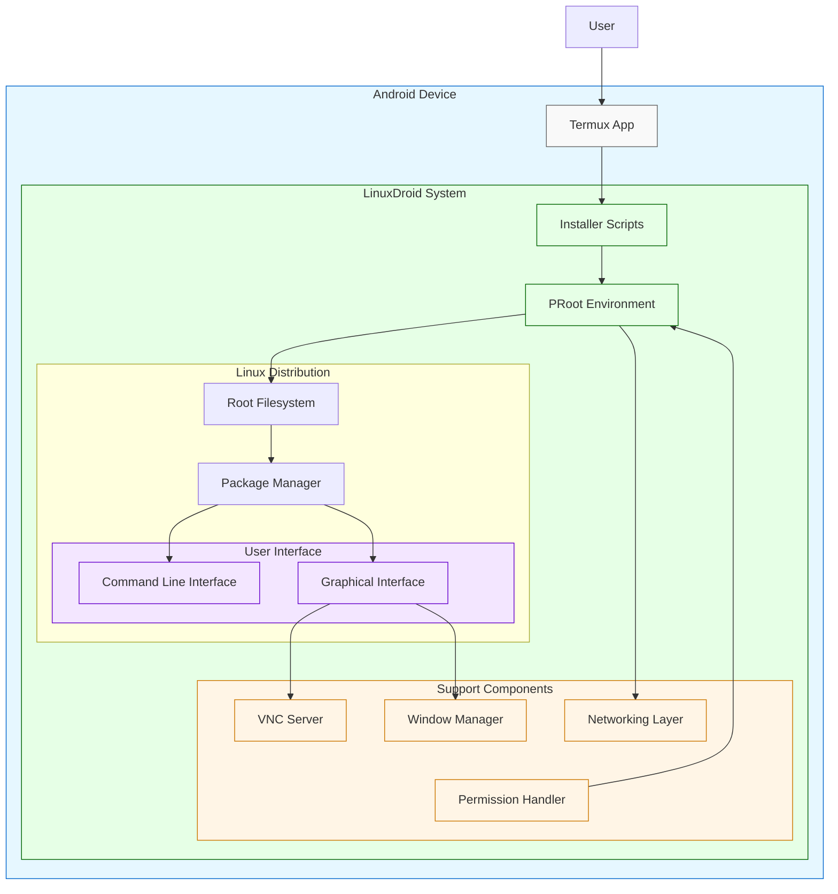
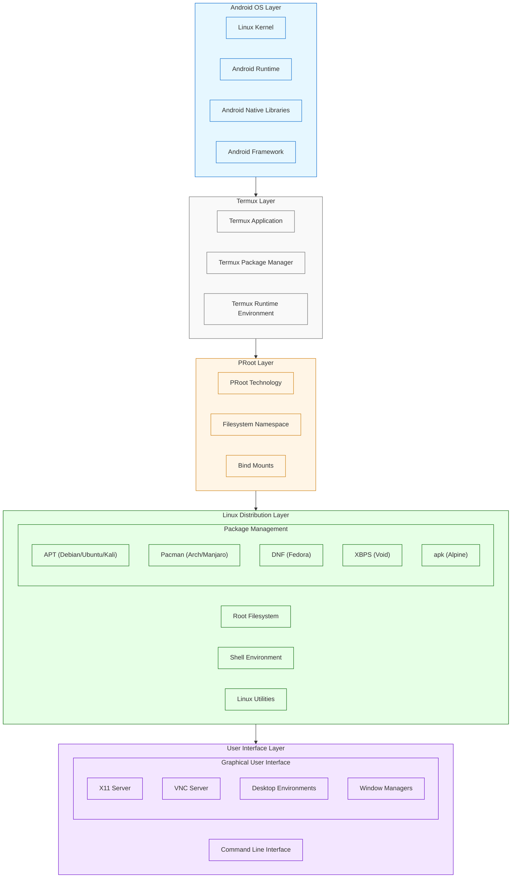
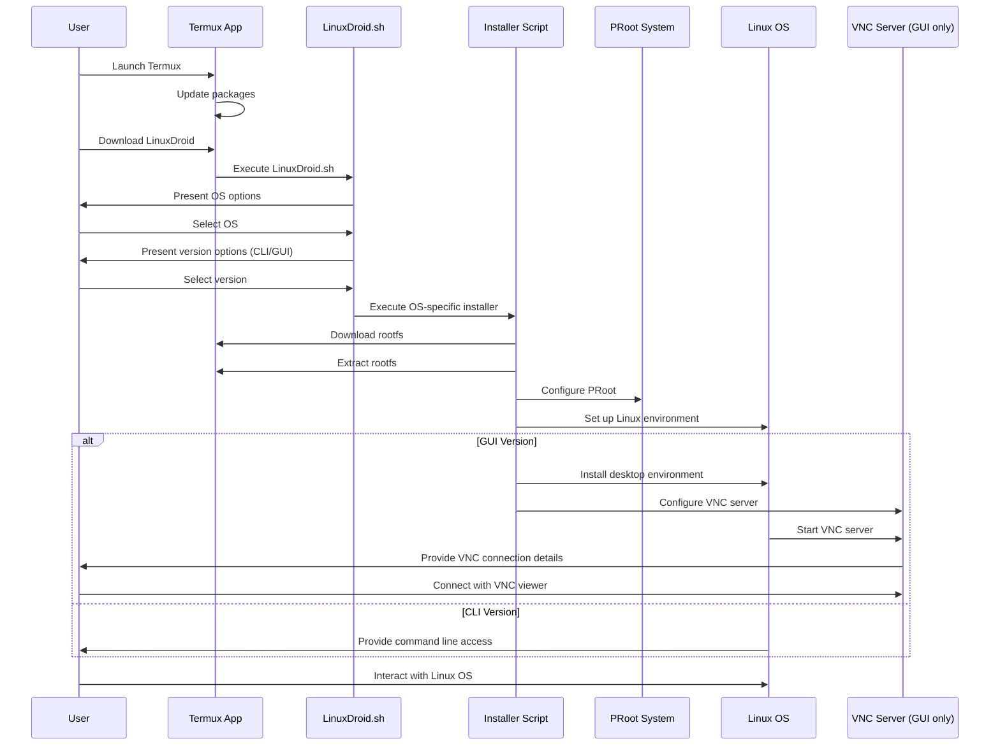

# LinuxDroid Project Structure

## Overview
LinuxDroid is a comprehensive solution for running Linux environments on Android devices, providing both CLI and GUI capabilities.

## Directory Structure

### Core Components
- `1click.install.sh` - One-click installation script
- `install.sh` - Base installation script
- `index.html` - Project landing page and documentation
- `LinuxDroid/` - Core system files and configurations

### Package Management
- `APT/` - Advanced Package Tool configurations
- `Pacman/` - Pacman package manager configurations
- `XBPS/` - X Binary Package System files

### Installation Components
- `Installer/` - Main installation scripts and utilities
- `Automatic installation script/` - Automated setup scripts
- `installation scripte/` - Additional installation utilities
- `Rootfs/` - Root filesystem components

### User Interface
- `WM/` - Window Manager configurations
- `vnc/` - VNC server configurations
- `Bootstrap/` - UI framework components

### Documentation
- `README.md` - Main project documentation
- `CONTRIBUTING.md` - Contribution guidelines
- `ChromiumOS.md` - ChromiumOS-specific documentation
- `Looks.md` - UI/UX documentation
- `structure.md` - This file - Project structure overview

### Resources
- `BannersAndmobile/` - Project banners and mobile-specific assets
- `screenshot/` - Application screenshots
- `ANSI-Shadow.flf` - ANSI shadow font file
- `lib.tar.xz` - Library archive

### Scripts
- `Scripts/` - Utility scripts
- `Uninstall/` - Uninstallation scripts

## Contributing
1. Read `CONTRIBUTING.md` for guidelines
2. Understand the project structure (this document)
3. Choose the appropriate directory for your contribution
4. Follow the coding standards and documentation practices

## Development Workflow
1. Installation scripts are in the `Installer/` directory
2. Package management configurations are separated by package manager
3. UI components are in `Bootstrap/` and `WM/`
4. Documentation updates should be made to relevant .md files

## Best Practices
1. Keep installation scripts modular
2. Document all major changes
3. Test on different Android versions
4. Maintain backward compatibility
5. Follow security best practices
# LinuxDroid: Architecture and Flow Diagrams

This document provides comprehensive visual representations of the LinuxDroid architecture, installation process, and how it enables running Linux distributions on Android devices.

## Table of Contents
- [Architecture Overview](#architecture-overview)
- [Installation Flow](#installation-flow)
- [System Layers](#system-layers)
- [Component Interaction](#component-interaction)
- [Execution Flow](#execution-flow)
- [Desktop Environment Implementation](#desktop-environment-implementation)
- [User Experience Flow](#user-experience-flow)

## Architecture Overview



## Installation Flow

```mermaid
flowchart TD
    Start([Start]) --> InstallTermux[Install Termux from F-Droid]
    InstallTermux --> UpdateTermux[Update Termux packages]
    UpdateTermux --> SetupStorage[Setup Termux storage]
    SetupStorage --> InstallDependencies[Install wget, curl, proot, tar]
    InstallDependencies --> DownloadScript[Download LinuxDroid.sh]
    DownloadScript --> ExecuteScript[Execute LinuxDroid.sh]
    
    ExecuteScript --> SelectOS{Select OS}
    SelectOS -->|Kali| Kali[Kali Linux]
    SelectOS -->|Ubuntu| Ubuntu[Ubuntu]
    SelectOS -->|Arch| Arch[Arch Linux]
    SelectOS -->|Debian| Debian[Debian]
    SelectOS -->|Manjaro| Manjaro[Manjaro]
    SelectOS -->|Void| Void[Void Linux]
    SelectOS -->|Alpine| Alpine[Alpine]
    SelectOS -->|Fedora| Fedora[Fedora]
    SelectOS -->|Nethunter| Nethunter[Nethunter Rootless]
    SelectOS -->|Parrot| Parrot[Parrot OS]
    
    Kali & Ubuntu & Arch & Debian & Manjaro & Void & Alpine & Fedora & Nethunter & Parrot --> SelectVersion{Select Version}
    
    SelectVersion -->|GUI| GUI[Download & Install GUI Version]
    SelectVersion -->|CLI| CLI[Download & Install CLI Version]
    
    GUI --> InstallDE[Install Desktop Environment]
    InstallDE --> SetupVNC[Setup VNC Server]
    SetupVNC --> ConfigureWM[Configure Window Manager]
    ConfigureWM --> LaunchGUI[Launch GUI Environment]
    
    CLI --> SetupCLI[Setup CLI Environment]
    SetupCLI --> LaunchCLI[Launch CLI Environment]
    
    LaunchGUI & LaunchCLI --> Complete([Installation Complete])
    
    classDef start fill:#f9f9f9,stroke:#333,stroke-width:2px
    classDef process fill:#e6f7ff,stroke:#0066cc
    classDef decision fill:#fff5e6,stroke:#cc7700
    classDef os fill:#e6ffe6,stroke:#006600
    classDef end fill:#f3e6ff,stroke:#6600cc
    
    class Start,Complete start
    class InstallTermux,UpdateTermux,SetupStorage,InstallDependencies,DownloadScript,ExecuteScript,InstallDE,SetupVNC,ConfigureWM,SetupCLI process
    class SelectOS,SelectVersion decision
    class Kali,Ubuntu,Arch,Debian,Manjaro,Void,Alpine,Fedora,Nethunter,Parrot os
    class LaunchGUI,LaunchCLI end
```

## System Layers



## Component Interaction



## Execution Flow

```mermaid
stateDiagram-v2
    [*] --> InitialLaunch: First-time launch
    
    state InitialLaunch {
        [*] --> InstallDependencies
        InstallDependencies --> ConfigureTermux
        ConfigureTermux --> DownloadLinuxDroid
        DownloadLinuxDroid --> [*]
    }
    
    InitialLaunch --> OSSelection
    
    state OSSelection {
        [*] --> ChooseDistribution
        ChooseDistribution --> ChooseVersion
        ChooseVersion --> [*]
    }
    
    OSSelection --> Installation
    
    state Installation {
        [*] --> DownloadRootfs
        DownloadRootfs --> ExtractRootfs
        ExtractRootfs --> ConfigureSystem
        ConfigureSystem --> [*]
    }
    
    Installation --> SetupEnvironment
    
    state SetupEnvironment {
        [*] --> SetupPRoot
        
        state "CLI Setup" as CLISetup
        state "GUI Setup" as GUISetup
        
        SetupPRoot --> CLISetup: CLI selected
        SetupPRoot --> GUISetup: GUI selected
        
        state CLISetup {
            [*] --> ConfigureBashrc
            ConfigureBashrc --> InstallUtilities
            InstallUtilities --> [*]
        }
        
        state GUISetup {
            [*] --> InstallXorg
            InstallXorg --> InstallDesktopEnvironment
            InstallDesktopEnvironment --> ConfigureVNC
            ConfigureVNC --> [*]
        }
        
        CLISetup --> [*]
        GUISetup --> [*]
    }
    
    SetupEnvironment --> LaunchSystem
    
    state LaunchSystem {
        [*] --> StartPRoot
        
        StartPRoot --> LaunchCLI: CLI selected
        StartPRoot --> LaunchGUI: GUI selected
        
        state LaunchGUI {
            [*] --> StartVNCServer
            StartVNCServer --> ConnectVNCViewer
            ConnectVNCViewer --> [*]
        }
        
        LaunchCLI --> [*]
        LaunchGUI --> [*]
    }
    
    LaunchSystem --> [*]: System running
```



## Desktop Environment Implementation

```mermaid
graph TB
    subgraph LinuxDroid["LinuxDroid GUI System"]
        OS["Linux Distribution"]
        
        subgraph X11["X11 Graphics System"]
            XServer["X Server (TigerVNC)"]
            DisplayMgr["Display Manager"]
        end
        
        subgraph DEs["Desktop Environments"]
            XFCE["XFCE"]
            LXDE["LXDE"]
            LXQT["LXQT"]
            MATE["MATE"]
            KDE["KDE Plasma (Beta)"]
            GNOME["GNOME (Coming Soon)"]
        end
        
        subgraph WMs["Window Managers"]
            Awesome["Awesome WM"]
            Openbox["Openbox"]
            i3["i3 WM"]
        end
        
        subgraph Apps["Applications"]
            Terminal["Terminal Emulator"]
            Browser["Web Browser"]
            Office["Office Applications"]
            Dev["Development Tools"]
            Pentesting["Penetration Testing Tools"]
        end
    end
    
    OS --> X11
    X11 --> DEs
    X11 --> WMs
    DEs --> Apps
    WMs --> Apps
    
    classDef os fill:#e6f7ff,stroke:#0066cc
    classDef x11 fill:#f9f9f9,stroke:#666666
    classDef de fill:#e6ffe6,stroke:#006600
    classDef wm fill:#fff5e6,stroke:#cc7700
    classDef apps fill:#f3e6ff,stroke:#6600cc
    
    class OS os
    class X11,XServer,DisplayMgr x11
    class DEs,XFCE,LXDE,LXQT,MATE,KDE,GNOME de
    class WMs,Awesome,Openbox,i3 wm
    class Apps,Terminal,Browser,Office,Dev,Pentesting apps
```



## User Experience Flow

```mermaid
graph LR
    Start([Start]) --> InstallTermux[Install Termux]
    InstallTermux --> SetupTermux[Setup Termux]
    SetupTermux --> LinuxDroidInstall[Install LinuxDroid]
    LinuxDroidInstall --> SelectDistro[Select Linux Distro]
    
    SelectDistro --> CLI[CLI Version]
    SelectDistro --> GUI[GUI Version]
    
    CLI --> CLIUsage[Use Linux CLI Tools]
    GUI --> InstallVNCViewer[Install VNC Viewer]
    InstallVNCViewer --> ConnectVNC[Connect to VNC]
    ConnectVNC --> GUIUsage[Use Linux GUI Interface]
    
    CLIUsage --> DevTools[Development Tasks]
    CLIUsage --> PentestTools[Security Testing]
    CLIUsage --> SysAdmin[System Administration]
    
    GUIUsage --> DesktopApps[Desktop Applications]
    GUIUsage --> VisualDev[Visual Development]
    GUIUsage --> MultimediaApps[Multimedia Applications]
    
    DevTools & PentestTools & SysAdmin & DesktopApps & VisualDev & MultimediaApps --> CompleteLinuxExp[Complete Linux Experience on Android]
    
    classDef start fill:#f9f9f9,stroke:#333,stroke-width:2px
    classDef setup fill:#e6f7ff,stroke:#0066cc
    classDef choice fill:#fff5e6,stroke:#cc7700
    classDef usage fill:#e6ffe6,stroke:#006600
    classDef tasks fill:#f3e6ff,stroke:#6600cc
    classDef end fill:#ffcccc,stroke:#cc0000
    
    class Start start
    class InstallTermux,SetupTermux,LinuxDroidInstall,InstallVNCViewer,ConnectVNC setup
    class SelectDistro,CLI,GUI choice
    class CLIUsage,GUIUsage usage
    class DevTools,PentestTools,SysAdmin,DesktopApps,VisualDev,MultimediaApps tasks
    class CompleteLinuxExp end
```
